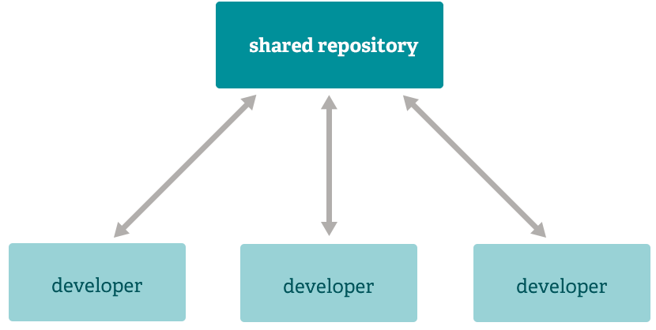
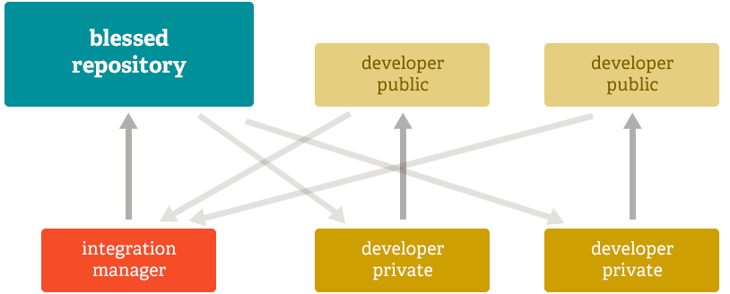
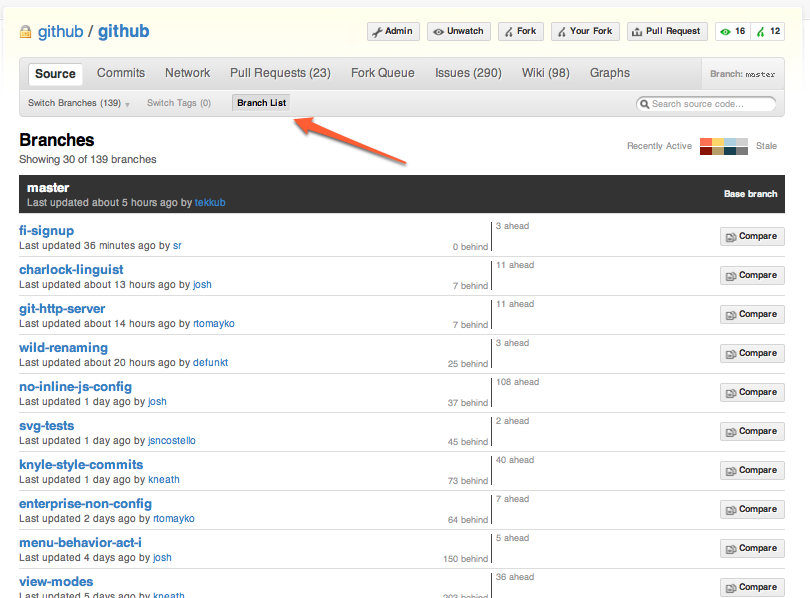

# Системы контроля версий

<!--  -->

Кирилл Корняков (Itseez, ННГУ)  
1 Октября 2013

<!-- TODO
  - Демо?
-->

# Содержание

  1. Введение
     - Определение и назвачение
     - Краткая история, поколения
     - Основные термины
  1. Git
     - Как DVCS и не только (Код, Сайт, Легковесная база данных)
     - Примеры хуков
     - Типичные сценарии
  1. Рабочие процессы, командная работа

# Введение

Перед каждым проектом, в особенности коллективным, встают следующие задачи:

  1. Небходимо **центральное** хранилище кода
     - Официальное, актуальное, защищенное, используемое всеми участниками
  2. Нужно уметь возвращаться к **прошлым** версиям
     - Откат дефектных изменений, поиск ошибок сравнением, извлечение кода "из прошлого"

Нужны ли специальные инструменты?

# Общие сведения

> **Системы контроля версий** - это программные системы, хранящие несколько
версий одного документа, и позволяющие вернуться к более ранним версиям. Как
правило, для каждого изменения запоминается дата модификации и автор.

  - Как правило используются для хранения исходного кода (source control), но
    имеются и другие применения: конфигурации, документация, компьютерная
    анимация, САПР и др.
  - На сегодняшний момент являются одним из ключевых инструментов разработки,
    появляется все больше примеров использования в других отраслях
    ([книгоиздание](https://github.com/certik/theoretical-physics),
    [государственные документы](http://www.youtube.com/watch?v=CEN4XNth61o)).

# Типичные функции

  1. Централизованное хранение исходного кода
     - Актуальное "официальное" состояние проекта
     - Удаленный доступ к проекту
     - Разграничение прав доступа
     - Использование в качестве запасного (backup) хранилища экспериментальных
       веток
  1. Возможность получения более ранних версий файлов
     - Получение истории индивидуального файла
     - Получение среза (snapshot) всего проекта

# Три поколения VCS

<table summary="Three Generations of Version Control" border="1">
  <colgroup><col align="center" class="col1"><col align="center" class="col2"><col align="center" class="col3"><col align="center" class="col4"><col align="center" class="col5">
  </colgroup>
  <thead valign="middle"><tr><th align="center" valign="middle">Generation</th><th align="center" valign="middle">Networking</th><th align="center" valign="middle">Operations</th><th align="center" valign="middle">Concurrency</th><th align="center" valign="middle">Examples</th></tr></thead>
  <tbody valign="middle"><tr><td align="center" valign="middle">First </td><td align="center" valign="middle">None</td><td align="center" valign="middle">One file at a time</td><td align="center" valign="middle">Locks</td><td align="center" valign="middle">RCS, SCCS</td></tr><tr><td align="center" valign="middle">Second </td><td align="center" valign="middle">Centralized</td><td align="center" valign="middle">Multi-file</td><td align="center" valign="middle">Merge  before  commit</td><td align="center" valign="middle">CVS, SourceSafe,  Subversion,  Team Foundation Server</td></tr><tr><td align="center" valign="middle">Third </td><td align="center" valign="middle">Distributed</td><td align="center" valign="middle">Changesets</td><td align="center" valign="middle">Commit  before  merge</td><td align="center" valign="middle">Bazaar,  Git,  Mercurial</td></tr>
  </tbody>
</table>

Eric Sink ["A History of Version Control"](http://www.ericsink.com/vcbe/html/history_of_version_control.html)

# Текущий статус

[DevProd Report Revisited: Version Control Systems in 2013](http://zeroturnaround.com/rebellabs/devprod-report-revisited-version-control-systems-in-2013/#!/)

# Основные термины

  - Репозиторий
    - Центральный
    - Форк, клон, зеркало
    - Локальный
    - Рабочая копия, рабочая папка

[Глоссарий](http://ru.wikipedia.org/wiki/%D0%A1%D0%B8%D1%81%D1%82%D0%B5%D0%BC%D0%B0_%D1%83%D0%BF%D1%80%D0%B0%D0%B2%D0%BB%D0%B5%D0%BD%D0%B8%D1%8F_%D0%B2%D0%B5%D1%80%D1%81%D0%B8%D1%8F%D0%BC%D0%B8#.D0.A1.D0.BB.D0.BE.D0.B2.D0.B0.D1.80.D1.8C)

# Базовые принципы
  
  1. Приложение строится только на на основе известного состояния репозитория:
     - Не только релизы, но и экспериментальные и тестовые сборки (builds).
     - В идеале приложение умеет сообщать свою ревизию и параметры сборки.
  1. Стабильность общих (публичных) веток:
     - Они обязаны компилироваться и проходить все тесты в любой момент времени.
     - Изменения тестируются до попадания в репозиторий.
     - Если дефектные изменения прошли, они исправляются в срочном порядке.
  1. Абсолютно вся разработка фиксируется в истории:
     - Это делается в виде отдельных веток локального или глобального репозитория.
     - "Удачные" изменения добавляются в основную ветвь.
  1. Публичная история проекта не "переписывается":
     - Однажды помеченные тэгами и выпущенные релизы модификации не подлежат.
     - Промежуточная история не переписывается, потому что будут конфликты.

# Резюме

# Контрольные вопросы

  1. Определение СКВ.
  1. Основные функции/возможности современных СКВ
  1. 
  1.
  1.

# Рабочие процессы

  1. Распределенные рабочие процессы (workflow)
     - Centralized
     - Integration Manager
     - Dictator and Lieutenants
  1. Модели ветвления (branching model)
     - GitHub Flow
     - GitFlow

# Centralized Workflow

  

# Integration Manager Workflow

  

# Dictator and Lieutenants Workflow

  

# GitHub Flow

  

[GitHub Flow](http://scottchacon.com/2011/08/31/github-flow.html)

# GitHub Flow

  - Anything in the `master` branch is deployable.
  1. Create branch
     - To work on something new, create a descriptively named branch off of `master` (ie: `new-oauth2-scopes`).
  1. Develop in branch
     - Commit to that branch locally and regularly push your work to the same named branch on the server.
  1. Open a pull request (ask for review)
     - When you need feedback or help, or you think the branch is ready for merging, open a pull request.
  1. Merge after review
     - After someone else has reviewed and signed off on the feature, you can merge it into `master`.
  1. Deploy
     - Once it is merged and pushed to `master`, you can and _should_ deploy immediately.

# Git Flow

  

A successful Git branching model ([link](http://nvie.com/posts/a-successful-git-branching-model/))

# Ссылки

  1. Wikipedia ["Системы контроля версий"](http://ru.wikipedia.org/wiki/%D0%A1%D0%B8%D1%81%D1%82%D0%B5%D0%BC%D0%B0_%D1%83%D0%BF%D1%80%D0%B0%D0%B2%D0%BB%D0%B5%D0%BD%D0%B8%D1%8F_%D0%B2%D0%B5%D1%80%D1%81%D0%B8%D1%8F%D0%BC%D0%B8#.D0.91.D0.B0.D0.B7.D0.BE.D0.B2.D1.8B.D0.B5_.D0.BF.D1.80.D0.B8.D0.BD.D1.86.D0.B8.D0.BF.D1.8B_.D1.80.D0.B0.D0.B7.D1.80.D0.B0.D0.B1.D0.BE.D1.82.D0.BA.D0.B8_.D0.9F.D0.9E_.D0.B2_VCS).
  1. [Pro Git](http://git-scm.com) by Scott Chacon.
  1. ["Mercurial tutorial"](http://hginit.com) by Joel Spolsky.

# Спасибо!

Вопросы?