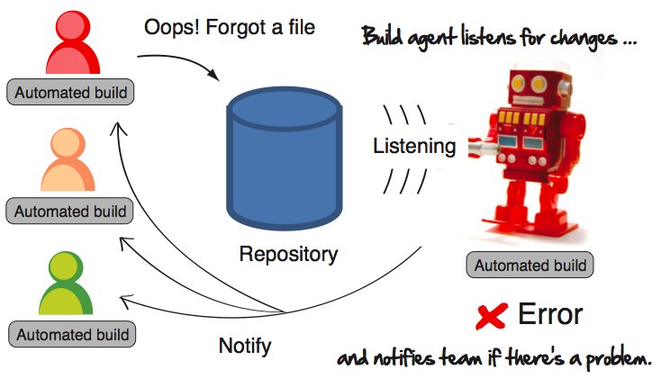
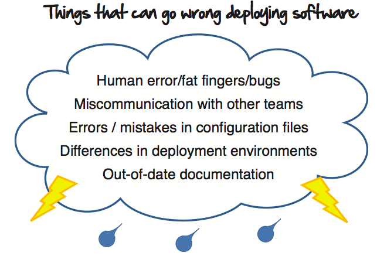
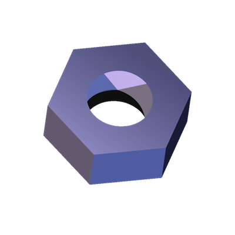
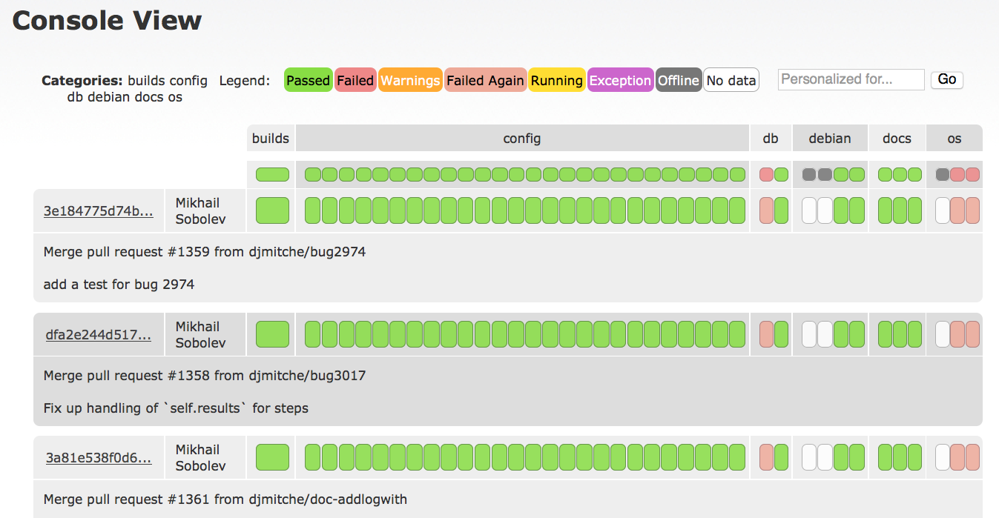

# Непрерывная интеграция

<!--  -->

Кирилл Корняков (Itseez, ННГУ)\
Ноябрь 2014

<!-- TODO
  - Написать подробнее про BuildBot
  - Рассмотреть конфиги Travis
  - Рассмотреть построение других артефактов (документация, дистрибы)
-->

# Содержание

  1. Практика непрерывной интеграции
  1. Системы непрерывной интеграции
  1. Travis CI
  1. BuildBot

# Непрерывная интеграция

> __Непрерывная интеграция (англ. Continuous Integration)__ — это практика
> разработки ПО, которая заключается в выполнении частых автоматизированных
> сборок проекта для скорейшего выявления и решения интеграционных проблем.

Непрерывная сборка — это __сердцебиение__ вашего проекта.

# Практика непрерывной интеграции



  1. Все хранится в __централизованном репозитории__:\
     исходный код, конфигурационные файлы, тестовые данные, сборочные и тестовые скрипты
  1. __Полная автоматизация__ операций с кодом:\
     выкачивание из репозитория, сборка, тестирование и так далее.

# Задачи выделенного сервера

  - Получение исходного кода из репозитория
  - Сборка проекта (в том числе построение дистрибутивов)
  - Выполнение тестов и автоматических проверок
  - Отправка отчетов (хранение истории и статистики)
  - Развёртывание готового проекта

<center></center>

# Автоматические проверки | Анализ качества кода

  - Стиль кодирования
    - Чистый код (именование, форматирование)
    - Анализ сложности
  - Статический анализ
    - Максимальный уровень предупреждений компилятора
    - Специальные инструменты
  - Динамический анализ
    - Утечки памяти, гонки данных
    - Анализ производительности

# Преимущества автоматического развертывания

Процедуры инсталляции, обновления, восстановления, удаления требуют особого
внимания и важны не менее (а может и более), чем собственно приложение.



# Возможные триггеры

  - На обновление состояния репозитория
  - Работа по расписанию (nightly testing)
  - Ручной запуск

# Эволюция взглядов на интеграцию

Можно условно представить в виде следующих практик:

  - __Waterfall__: разделить на компоненты, реализовать, интеграция — отдельная
    фаза
  - __Nightly build__: интегрироваться часто, ночной билд (harthbeet of the
    project)
  - __Continuous Integration__: интегрироваться непрерывно, тестирование каждого
    вливания
  - __Pre-commit Testing__: интегрироваться непрерывно, но после проверки
    стабильности
  - __Continuous Deployment__: развертываться непрерывно, но после проверки
    стабильности

Какой подход реализуется механизмом pull request на GitHub?

# Примеры систем

  - Hudson > Jenkins
  - CruiseControl (CruiseControl.NET), TeamCity
  - Travis CI (аналог <https://drone.io>)
  - BuildBot

# Travis CI

+---------------------+------------------------------------------------------------+
|| - Официальный сайт проекта: <http://travis-ci.org>         |
|                     | - Веб-сервис для сборки и тестирования ПО                  |
|                     |   ([open-source](<https://github.com/travis-ci/travis-ci>))|
|                     | - Важными особенностями являются интеграция с GitHub       |
|                     |   и возможность бесплатного использования                  |
|                     | - Поддерживает большое количество языков: C, C++,          |
|                     |   Clojure, Erlang, Go, Groovy, Haskell, Java,              |
|                     |   JavaScript, Perl, PHP, Python, Ruby и Scala              |
|                     | - Тестирование происходит на виртуальных Linux-машинах,    |
|                     |   запускаемых в облаке Amazon (Amazon S3)                  |
+---------------------+------------------------------------------------------------+

# ` devtools-course-practice / .travis.yml`

```YAML
language: cpp
compiler:
  - gcc
  - clang
install:
  - sudo pip install cpp-coveralls
before_script:
  - if [ "$CXX" = "g++" ]; then sudo add-apt-repository ppa:ubuntu-toolchain-r/test -y; fi
  - if [ "$CXX" = "g++" ]; then sudo apt-get update -qq; fi
  - if [ "$CXX" = "g++" ]; then sudo apt-get install -qq g++-4.8; fi
  - if [ "$CXX" = "g++" ]; then export CXX="g++-4.8" CC="gcc-4.8"; fi
script:
  - cd ./code && ./build-and-test.sh
after_success:
  - coveralls --exclude code/3rdparty -E ".*\.cpp" --extension cxx --root ../ --build-root ../build_cmake
notifications:
  email: false
```

# `agile-course-practice / .travis.yml`

```YAML
language: java
jdk:
  - oraclejdk8
script:
  - cd code
  - TERM=dumb
  - gradle check
notifications:
  email: false
```

# `rubinius / .travis.yml`

```YAML
language: cpp
compiler:
  - gcc
  - clang
before_install:
  - echo $LANG
  - echo $LC_ALL
  - if [ $TRAVIS_OS_NAME == linux ]; then sudo apt-get install -y llvm-3.4 llvm-3.4-dev; fi
  - if [ $TRAVIS_OS_NAME == osx ]; then brew update && brew install llvm && brew link --force llvm; fi
  - rvm use $RVM --install --binary --fuzzy
  - gem update --system
  - gem --version
before_script:
  - travis_retry bundle
  - if [ $TRAVIS_OS_NAME == linux ]; then travis_retry ./configure --llvm-config llvm-config-3.4; fi
  - if [ $TRAVIS_OS_NAME == osx ]; then travis_retry ./configure --llvm-config /usr/local/opt/llvm/bin/llvm-config; fi
script: rake
branches:
  only:
    - master
    - 1.8.7
notifications:
  email:
    recipients:
      - brixen@gmail.com
      - d.bussink@gmail.com
    on_success: change
    on_failure: always
  irc:
    channels:
      - "chat.freenode.net#rubinius"
    template:
      - "%{repository}/%{branch} (%{commit} - %{author}): %{message}"
env:
  - RVM=2.0.0 LANG="en_US.UTF-8"
os:
  - linux
  - osx
osx_image: xcode61
```

# BuildBot

+------------------------+----------------------------------------------------------+
|| - Официальный сайт проекта: <http://buildbot.net>        |
|                        | - Инструмент непрерывной интеграции                      |
|                        | - Используется в ряде крупных проектов: Chromium, WebKit,|
|                        |   Firefox, Python, OpenCV                                |
|                        | - Реализован на Python, как результат переносим и        |
|                        |   допускает кастомизацию (программирование билдеров)     |
|                        | - Проект разрабатывается на                              |
|                        |   [GitHub](<https://github.com/buildbot/buildbot>),      |
|                        |   тестируется при помощи                                 |
|                        |   [Travis CI](https://travis-ci.org/buildbot/buildbot/)  |
+------------------------+----------------------------------------------------------+

# BuildBot

<center></center>

# BuildBot

<center></center>

# Ключевые моменты

  1. 

# Контрольные вопросы

  1. Определение непрерывной интеграции
  1. Задачи выделенного сервера
  1. Эволюция взглядов на непрерывную интеграцию
  1. Travis CI, преимущества и недостатки
  1. BuildBot, преимущества и недостатки

# Спасибо!

Вопросы?
